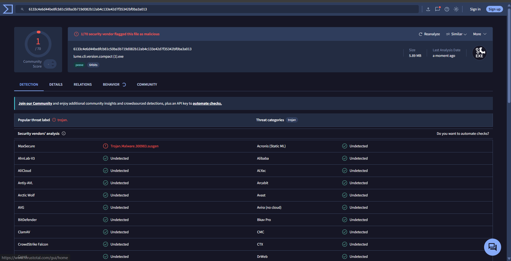

# lume 🍃 
 
### fotoğraf ve video arşivleme: EXIF metadata'sı ile otomatik klasörleme, MD5 (Python) ve SHA-256 (Go) ile kopya algılama


## Uygulama ile alakalı birkaç ekran görüntüsü / A few screenshots related to the app

<p align="center">
     
    
    
    
    
    
    
    
    
    
    
    
    
    
    
    
    
    
</p>

---
Türkçe Tanıtım
- Dosya Düzenleyici: 
Bilgisayarınızdaki dosyaları tek tek düzeltmeye artık gerek yok. Bu tool belirli formattaki dosyaları saniyeler içinde tarar, tek bir klasör altında güvenle kopyalayıp arşivler ve işlem sonunda detaylı bir liste sunar.

Avantajları neler?
.Yüzlerce dosyayı tek tek seçmek yerine tek tıkla hedef klasöre aktarın.

.İhtiyacınız olan desteklenen medya uzantılarını arşivleyebilirsiniz (.jpg, .png, .mp4, .mov vb.).

.İşlem sonunda hangi dosyanın nereye kopyalanıp arşivlendiğini net bir şekilde görün.

---

English Introduction
- File Editor:

No need to manually edit files on your computer one by one. This tool scans files of a specific format in seconds, securely copies and archives them under a single folder, and provides a detailed list at the end of the process.

What are the advantages?
. Transfer hundreds of files to the target folder with a single click instead of selecting them one by one.

. Target only the supported media extensions you need (.jpg, .png, .mp4, .mov, etc.).

. Clearly see which file was copied and archived where at the end of the process.

---

Versiyonlar: Lume'un 3 farklı sürümü bulunmaktadır: Python GUI, Go GUI ve Go CLI. Her sürüme ait dosyalar ve ekran görüntüleri bu repoda detaylı olarak bulunuyor.

Versions: Lume has 3 different versions: Python GUI, Go GUI, and Go CLI. Files and screenshots for each version are available in detail in this repository.

---

### 💻 Proje Teknolojileri / Project Technologies:

<p align="left">
  <a href="https://www.python.org" target="_blank" rel="noreferrer">
    
  </a>
  <a href="https://go.dev" target="_blank" rel="noreferrer">
    
  </a>
  <a href="https://github.com/" target="_blank" rel="noreferrer">
    
  </a>
  <a href="https://github.com/features/copilot" target="_blank" rel="noreferrer">
    
  </a>
  <a href="https://code.visualstudio.com/" target="_blank" rel="noreferrer">
    
  </a>
</p>

---

## Gizlilik & Güvenlik

Tüm işlemler yerel makinenizde çalışır.
İnternet bağlantısı gerekmez.
Veri toplama yok.
Dosyalar bilgisayarınızda tutulur
Açık kaynak bir projedir
Kişisel veri saklanmaz veya gönderilmez

## Veri Depolama
- `lume_config.json` - GUI sürümlerinde yerel ayarlar 

- `lume_app.log` - GUI sürümlerinde yerel işlem loglanması

---

## Privacy & Security

All operations run locally on your machine
No internet connection required or used
No data collection or analytics
Files stay on your computer
Full code transparency

## Data Storage

- `lume_config.json` - Local settings for GUI versions 
  
- `lume_app.log` - Local operation log for GUI versions
  
- **No personal data** is stored or transmitted

---

## VirusTotal Doğrulamaları / VirusTotal Verification

Lume'un Python GUI, Go GUI ve Go CLI sürümleri için yayınlanan çalıştırılabilir dosyalar VirusTotal üzerinde ayrıca kontrol edilebilir. Bu bölüm, release dosyalarının güvenlik tarama sonuçlarını README içinde tek yerde göstermek için ayrılmıştır.

VirusTotal sonuçları tek başına mutlak garanti değildir; ancak kullanıcıların indirdikleri dosyayı bağımsız antivirüs motorlarıyla karşılaştırmasına yardımcı olur. Lume internet bağlantısı gerektirmeden yerel makinede çalışır, telemetri veya analiz verisi göndermez ve dosya düzenleme işlemlerini kullanıcının seçtiği kaynak/hedef klasörler üzerinde yürütür.

The executable files published for the Python GUI, Go GUI, and Go CLI versions of Lume can also be checked on VirusTotal. This section is reserved to keep the security scan screenshots for all three versions in one place.

VirusTotal results are not an absolute guarantee by themselves, but they help users compare the downloaded files against independent antivirus engines. Lume runs locally without requiring an internet connection, does not send telemetry or analytics data, and only works on the source/target folders selected by the user.

| Sürüm / Version | Dosya / File | VirusTotal Görseli / Screenshot |
| --- | --- | --- |
| Python GUI | `Lume.exe` | Görsel eklenecek / Screenshot will be added |
| Go GUI | `Lume_Pro.exe` | Görsel eklenecek / Screenshot will be added |
| Go CLI | `lume.cli.version.compact.exe` | [Go CLI VirusTotal scan](screenshots/virustotal/go-cli-virustotal.png) |

<p align="center">
  
</p>

---
Lume CLI

- Lume CLI versiyonunu kullanmak için GitHub'daki dosyaları indirin ve aşağıdaki adımları izleyin.

- 🇹🇷 Türkçe Kullanım

Adım 1: PowerShell'i Açın
- `Windows + R` tuşlarına basın.
- `powershell` yazıp Enter tuşuna basın.

Adım 2: EXE'nin Olduğu Klasöre Gidin
```powershell
cd "C:\DosyaYolu\lume-app\cli version lume"
```
*(Lütfen `"C:\DosyaYolu..."` kısmını indirdiğiniz proje klasörünün kendi bilgisayarınızdaki gerçek yolu ile değiştirin.)*

Adım 3: Programı Çalıştırın

Varsayılan olarak doğrudan dosya sistemi değiştirme tarihini (ModTime) kullanarak arşivlemek için:
```powershell
.\Lume_LITE.exe "C:\KaynakKlasor" "C:\HedefKlasor"
```

Seçenekler ve Parametreler:
* `--exif`       : Görsellerde ve RAW dosyalarında EXIF çekim tarihini (DateTimeOriginal) okur.
* `--rename`     : Dosyaları hedef dizine kopyalarken `YYYYMMDD_HHMMSS` formatında yeniden adlandırır.
* `--dry-run`    : Simülasyon modunda çalışır. Diske hiçbir klasör oluşturulmaz veya kopyalama yapılmaz.
* `--help`, `-h` : Yardım menüsünü ve parametre listesini görüntüler.

Örnek (EXIF ve Yeniden Adlandırma ile Kopyalama):
```powershell
.\Lume_LITE.exe "C:\KaynakKlasor" "C:\HedefKlasor" --exif --rename
```

---

- To use the Lume CLI version, download the files from GitHub and follow the steps below:

- 🇬🇧 English Usage
  
Step 1: Open PowerShell
- Press `Windows + R`.
- Type `powershell` and press Enter.

Step 2: Navigate to EXE Folder
```powershell
cd "C:\PathToProject\lume-app\cli version lume"
```
*(Please replace `"C:\PathToProject..."` with the actual path of the project folder on your computer.)*

Step 3: Run the Program

By default, to archive files using their file system modification date (ModTime):
```powershell
.\Lume_LITE.exe "C:\SourceFolder" "C:\TargetFolder"
```

Options and Parameters:
* `--exif`       : Reads EXIF shooting date (DateTimeOriginal) from images and RAW files.
* `--rename`     : Renames files to `YYYYMMDD_HHMMSS` format when copying to target.
* `--dry-run`    : Runs in simulation mode. No folders are created on disk.
* `--help`, `-h` : Shows the bilingual help menu.

Example (with EXIF and renaming):
```powershell
.\Lume_LITE.exe "C:\SourceFolder" "C:\TargetFolder" --exif --rename
```

---

Serbest / Misc:

- Uygulamanın genel amacı desteklenen formatlardaki dosyaları bilgisayarınızda düzgün bir şekilde kopyalayıp arşivlemektir.
- Uygulamanın tüm versiyonlarını güvenlik taramalarından geçirdim ve tespit ettiğim potansiyel riskleri düzeltip kod güvenliğini artırdım. Düzeltilen kısımlar ve arkasındaki mantık hakkında yakında bir blog yazısı da paylaşacağım. Uygulamayla ilgili her türlü geri bildirim ve soru için "artabqos251@gmail.com" adresinden bana ulaşabilirsiniz.

- The main purpose of the application is to neatly copy and archive files in supported formats on your computer.
- I have conducted comprehensive security scans on all versions of the application, resolving potential risks and improving code safety. I will also publish a blog post detailing these fixes and the engineering decisions behind them. For any inquiries or feedback, feel free to contact me at "artabqos251@gmail.com".

---

### ⚠️ Bilinen Sorunlar / Known Issues

* **Koyu Mod Tablo Görünümü / Dark Mode Table View (Go GUI)**: 
  * 🇹🇷 Go GUI sürümündeki koyu mod butonuna basıldığında tablonun (TableView) ve bazı butonların tamamen koyulaşmaması (beyaz kalması) sorunu bilinmektedir. Bu durum Windows işletim sisteminin yerel Win32 listview temalarından kaynaklanmaktadır. Bu sorun ileriki sürümlerde ele alınacaktır.
  * 🇬🇧 There is a known issue in the Go GUI version where the TableView and certain buttons fail to completely darken (remaining white) when Dark Mode is enabled. This is related to the native Win32 listview theme engine in Windows and will be addressed in future releases.
  

